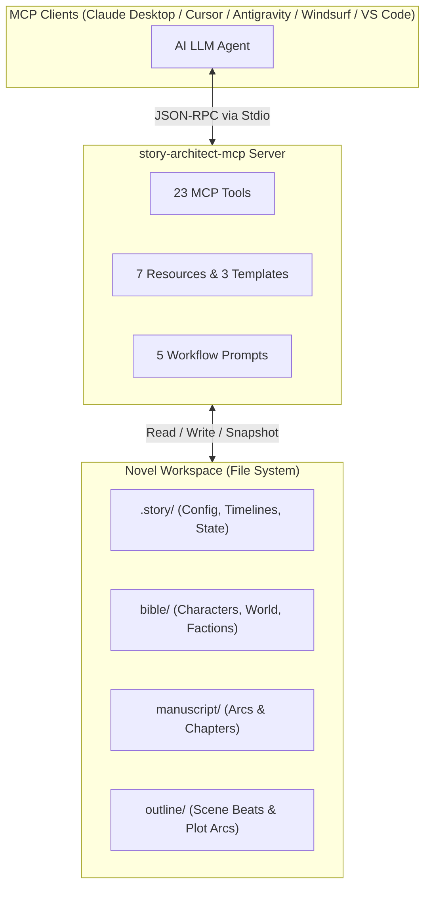

# story-architect-mcp

<div align="center">

[](https://modelcontextprotocol.io)
[](https://nodejs.org)
[](https://www.typescriptlang.org/)
[](LICENSE)

**A Model Context Protocol (MCP) Server for AI-Assisted Long-Form Fiction Writing, Worldbuilding, Continuity Auditing, and Novel Architecture.**

[🚀 Quick Start & 1-Click Setup](#-quick-start--1-click-setup) • [Key Features](#-key-features) • [Novel-as-Code](#-the-novels-as-codebases-paradigm) • [Client Configs](#%EF%B8%8F-mcp-client-configuration) • [API Reference](#%EF%B8%8F-mcp-api-reference)

</div>

---

## 📖 Overview & Core Philosophy

Writing long-form fiction (epics, thrillers, fantasy sagas, or multi-volume series) with AI assistance introduces severe context degradation, narrative drift, and structural inconsistencies. As manuscripts expand to tens or hundreds of thousands of words, LLMs easily forget minor lore points, character arcs, timeline logic, and voice guidelines.

**`story-architect-mcp`** solves this problem by pioneering the **"Novels as Codebases" (NaC)** paradigm. It bridges your AI writing assistant directly to a structured fiction repository via the **Model Context Protocol (MCP)**.



---

## 🚀 Quick Start & 1-Click Setup

### Cách 1: Tự Động 1-Lệnh (Khuyên Dùng) ⚡

Không cần chỉnh sửa file JSON thủ công! Chạy trình hướng dẫn cài đặt tự động để tự phát hiện và cấu hình cho tất cả MCP client có trên máy:

```bash
npx -y story-architect-mcp setup
```

Hoặc dùng script 1-dòng:
* **macOS / Linux**:
  ```bash
  curl -fsSL https://raw.githubusercontent.com/PTCuong-1102/story-architect-mcp/main/scripts/install.sh | bash
  ```
* **Windows (PowerShell)**:
  ```powershell
  iwr -useb https://raw.githubusercontent.com/PTCuong-1102/story-architect-mcp/main/scripts/install.ps1 | iex
  ```

---

### Cách 2: Khởi Tạo Dự Án Tiểu Thuyết Mới (Novel Scaffolding)

Tạo ngay một workspace tiểu thuyết chuẩn với đầy đủ hồ sơ nhân vật mẫu, lore thế giới, tóm tắt cốt truyện và chương 1:

```bash
npx -y story-architect-mcp init-novel ./my-epic-novel
```

---

### Cách 3: Kiểm Tra Môi Trường & Chẩn Đoán (Doctor Tool)

Kiểm tra trạng thái Node.js và các file cấu hình MCP client:

```bash
npx -y story-architect-mcp doctor
```

---

## 💡 The "Novels as Codebases" Paradigm

| Software Engineering Concept | Novel Architecture Equivalent | `story-architect-mcp` Implementation |
|---|---|---|
| **Modules & Packages** | Arcs & Chapters | Standardized `manuscript/arc_01/ch_001.md` structure |
| **Interfaces & Schemas** | Character Bible & Lore | Frontmatter-backed Markdown files in `bible/` |
| **Compiler & Linter** | Continuity & Pacing Auditing | `story_detect_timeline_conflicts`, `story_analyze_voice` |
| **Bug Tracker** | Plot Hole & Chekhov's Gun Registry | `story_log_plot_hole`, `story_log_setup`, `story_log_payoff` |
| **Git & Rollback** | Point-in-Time Snapshots | `story_snapshot` and `story_rollback` safety engine |
| **Dependency Injection** | Context Budgeting | `story_query_context` (Graph Memory + Semantic Search) |

---

## ✨ Key Features

### 🧹 1. Messy Project Rescue & Auto-Refactoring
* **Smart File Classifier (`story_scan_messy_project`)**: Scans unorganized manuscript folders, auto-detects character encodings (UTF-8, Windows-1252, ISO-8859-1), computes content similarity matrices, and tags files (`Manuscript`, `Lore`, `Notes`, `Outline`) with confidence scores.
* **Automated Refactoring (`story_auto_refactor_structure`)**: Reorganizes scattered files into a clean project structure with safe dry-run previews (`confirm: false`).
* **Snapshot & Rollback Protection (`story_snapshot` / `story_rollback`)**: Creates automatic point-in-time state backups prior to file operations.

### 🔍 2. Continuity Auditing & Plot Hole Tracking
* **Plot Hole Manager (`story_log_plot_hole` / `story_resolve_plot_hole`)**: Tracks unresolved plot holes, severity levels, and proposed fixes directly in `.story/unresolved_holes.json`.
* **Chekhov’s Gun Tracker (`story_log_setup` / `story_log_payoff`)**: Ensures planted clues or foreshadowed events are resolved before the story concludes.
* **Timeline Conflict Detector (`story_detect_timeline_conflicts`)**: Audits character ages, event order, and absolute dates, generating interactive **Mermaid Flowchart Timeline Diagrams**.

### 🧠 3. Knowledge Graph & Story Bible Integration
* **Automatic Entity Extraction (`story_extract_entities_to_bible`)**: Parses chapter drafts to automatically create structured Markdown profiles in `bible/characters/` and `bible/world/`.
* **Dynamic Relationship Graph (`story_map_relationships`)**: Tracks changing relationships between characters across chapters into `.story/relationships.json` — can be auto-detected from manuscript co-occurrences or updated manually.
* **Token-Budget Context Querying (`story_query_context`)**: Generates optimized context packages for LLMs by combining graph memory traversal with token budget constraints.

### 📈 4. Pacing, Voice, Sentiment & Analytics
* **Pacing Inspector (`story_analyze_pacing`)**: Measures Action / Dialogue / Description distribution and scene tension curves across chapters.
* **Voice Drift Monitor (`story_analyze_voice`)**: Evaluates sentence complexity, vocabulary richness, POV/tense compliance, and dominant emotions against your `.story/style_guide.json`.
* **Sentiment & Tone Analyzer (`story_analyze_sentiment` / `story_track_emotion`)**: Performs lexicon-based emotional arc tracking, polarity calculation, tone classification (8 categories), and tone drift detection across chapters.
* **Writing Statistics (`story_stats`)**: Real-time word counts, writing velocity, and estimated project completion dates.

### ✍️ 5. AI Prompt Generator & Manuscript Export
* **Context-Rich Prompt Builder (`story_generate_writing_prompt`)**: Automatically compiles lore, recent chapter endings, outline beats, and active Chekhov's guns into an optimized writing prompt.
* **Multi-Format Export (`story_export`)**: Compiles manuscript files into Markdown, HTML, EPUB, or DOCX formats with custom metadata and Table of Contents. (For PDF, export to HTML and print-to-PDF from a browser.)

---

## 📁 Standard Project Architecture

`story-architect-mcp` organizes novel projects into a standardized layout:

```text
my-epic-novel/
├── .story/                      # Project metadata & state tracking
│   ├── config.json              # Title, Author, Genre, POV, Tense
│   ├── status.json              # Word counts & progress tracking
│   ├── timeline.json            # Event chronology & dates
│   ├── unresolved_holes.json    # Active plot hole registry
│   ├── relationships.json       # Character relationship matrix
│   ├── foreshadowing.json       # Chekhov's gun tracker (Setups & Payoffs)
│   ├── style_guide.json         # Voice, tone, sentence rules & reference excerpts
│   └── snapshots/               # Version snapshots for rollback protection
├── .cbm/                         # Knowledge Graph cache & index
│   └── index.json                # Precomputed entity/relationship index
├── bible/                       # Story Bible & Worldbuilding Lore
│   ├── characters/              # Character profiles with YAML frontmatter
│   ├── world/                   # Locations, factions, magic/tech systems
│   └── subplots/                # Subplot tracking & arc objectives
├── manuscript/                  # Official Manuscript Drafts
│   └── arc_01/
│       ├── ch_001.md
│       └── ch_002.md
├── outline/                     # Master Outline & Chapter Beats
│   ├── synopsis.md              # High-level story synopsis
│   ├── themes.md                # Themes & key motifs
│   └── arc_01/
│       ├── overview.md          # Arc overview
│       └── ch_001_outline.md    # Scene beats per chapter
└── drafts_raw/                  # Loose, unorganized writing snippets
```

---

## ⚙️ MCP Client Configuration (Manual Setup)

Nếu bạn muốn cấu hình thủ công thay vì chạy `npx story-architect-mcp setup`:

> **💡 Zero-Config Project Switching**: Bạn **không** bắt buộc phải cố định đường dẫn novel project trong tham số khởi động. Khi server chạy, AI có thể tự chọn hoặc chuyển đổi dự án tại runtime bằng tool `story_set_project`.

### Claude Desktop (`claude_desktop_config.json`)

```json
{
  "mcpServers": {
    "story-architect": {
      "command": "npx",
      "args": ["-y", "story-architect-mcp"]
    }
  }
}
```

### Antigravity / Cursor / Windsurf / VS Code (`mcp.json` / `cline_mcp_settings.json`)

```json
{
  "mcpServers": {
    "story-architect": {
      "command": "npx",
      "args": ["-y", "story-architect-mcp"]
    }
  }
}
```

---

## 🛠️ MCP API Reference

### 1. MCP Tools (23 Tools)

#### 🔹 Project & Structure Management
| Tool Name | Key Parameters | Description |
|---|---|---|
| `story_set_project` | `projectPath` | Sets or switches the target novel project directory dynamically at runtime. |
| `story_get_project_info` | *none* | Returns status, path, configuration, and word count of the active project. |
| `story_init` | `template`, `title`, `author`, `genre`, `pov`, `tense` | Initializes project directory with predefined genre templates. |
| `story_stats` | *none* | Computes total manuscript word count, writing velocity, and estimated completion date. |

#### 🔹 Rescue & Refactoring Suite
| Tool Name | Key Parameters | Description |
|---|---|---|
| `story_scan_messy_project` | `path` | Scans unorganized directories, detects encoding, and classifies loose files. |
| `story_auto_refactor_structure` | `strategy`, `confirm` | Refactors messy files into the standard novel structure (supports dry-run). |
| `story_snapshot` | `description` | Creates a point-in-time state snapshot in `.story/snapshots/`. |
| `story_rollback` | `snapshot_id`, `confirm` | Restores project state to a designated snapshot. |

#### 🔹 Continuity & Management Suite
| Tool Name | Key Parameters | Description |
|---|---|---|
| `story_log_plot_hole` | `title`, `description`, `severity`, `location`, `suggested_fix` | Registers an unresolved narrative plot hole or inconsistency. |
| `story_resolve_plot_hole` | `hole_id`, `resolution_note` | Resolves or dismisses a logged plot hole. |
| `story_log_setup` | `title`, `description`, `chapter`, `character` | Logs a foreshadowing setup (Chekhov's Gun). |
| `story_log_payoff` | `setup_id`, `payoff_chapter`, `description` | Marks a foreshadowing setup as paid off. |
| `story_list_unfired` | *none* | Lists all planted foreshadowing items that haven't been resolved yet. |

#### 🔹 Graph Memory & Context Suite
| Tool Name | Key Parameters | Description |
|---|---|---|
| `story_extract_entities_to_bible` | `chapter_path`, `confirm` | Automatically extracts characters and locations from chapter drafts into `bible/`. |
| `story_map_relationships` | `chapter_range` | Builds and updates inter-character relationship matrix across chapters. |
| `story_query_context` | `query`, `budget_tokens` | Extracts context packages using knowledge graph memory + vector search. |

#### 🔹 Analysis & Prompt Generator Suite
| Tool Name | Key Parameters | Description |
|---|---|---|
| `story_detect_timeline_conflicts` | `arc_id` | Audits event chronology for conflicts and renders a Mermaid Gantt timeline. |
| `story_analyze_pacing` | `chapter_range` | Computes Action / Dialogue / Description ratio and scene tension curves. |
| `story_analyze_voice` | `chapter_range` | Checks sentence length, vocabulary richness, and POV/tense compliance against style guide. |
| `story_analyze_sentiment` | `arc`, `chapter`, `windowSize`, `compareToStyleGuide` | Analyzes chapter/arc sentiment, dominant emotions, tone classification, emotional arcs, and detects tone drift. |
| `story_track_emotion` | `text` | Standalone emotion and tone tracker for quick drafting feedback on arbitrary text passages. |
| `story_generate_writing_prompt` | `target_chapter_id`, `strategy` | Compiles lore, outlines, recent endings, and style rules into an optimized prompt. |
| `story_export` | `format`, `output_path`, `include_outline` | Compiles manuscript into Markdown, HTML, EPUB, or DOCX formats. |

---

### 2. MCP Resources (7 Static & 3 Templates)

#### Static Resources
| Resource URI | Description | MIME Type |
|---|---|---|
| `story://status` | Live project word counts, progress, and status | `application/json` |
| `story://config` | Project settings (Title, Author, Genre, POV, Tense) | `application/json` |
| `story://timeline` | Story timeline events and chronological entries | `application/json` |
| `story://holes` | List of unresolved plot holes and continuity warnings | `application/json` |
| `story://foreshadowing` | Unfired Chekhov's guns and foreshadowing setups | `application/json` |
| `story://relationships` | Character relationship matrix and interaction states | `application/json` |
| `story://emotions` | Project-wide cached sentiment and emotional arc summary | `application/json` |

#### Resource Templates
| Template URI | Description | MIME Type |
|---|---|---|
| `story://bible/characters/{name}` | Profile, frontmatter, and lore for a specific character | `text/markdown` |
| `story://bible/world/{location}` | Description, history, and lore for a location or faction | `text/markdown` |
| `story://manuscript/{arc}/{chapter}` | Manuscript text for a specific chapter in an arc | `text/markdown` |

---

### 3. MCP Workflow Prompts (5 Prompts)

| Prompt Name | Required Arguments | Workflow Description |
|---|---|---|
| `write-next-chapter` | `arc`, `chapter` | Gathers lore, preceding chapter endings, outline beats, and style rules into an optimized prompt for writing the next chapter. |
| `character-deep-dive` | `name` | Aggregates a character's Bible entry alongside all scene appearances across the manuscript for deep analysis. |
| `continuity-audit` | `arc` | Scans an entire arc to detect timeline errors, term inconsistencies, and unresolved setups. |
| `rescue-project` | `projectPath` *(optional)* | Step-by-step guided workflow for scanning, previewing, and refactoring chaotic manuscript folders. |
| `brainstorm-scene` | `arc`, `chapter` | Generates 3–5 distinct scene execution options based on current outline and plot state. |

---

## 🛡️ Data Integrity & Safety Protocol

Writing a novel takes months or years; `story-architect-mcp` is designed with strict data preservation measures:

1. **Dry-Run Mode First (`confirm: false`)**: All destructive or structural refactoring tools run in Preview mode by default. You can inspect exact proposed file moves and edits before confirming execution (`confirm: true`).
2. **Automated Pre-Refactor Snapshots**: Executing structural changes automatically triggers `story_snapshot` to create a rollback checkpoint prior to file operations.
3. **Transparent File Formats**: All metadata is stored as standard JSON in `.story/`, and all story content is stored in plain Markdown with YAML frontmatter—ensuring zero vendor lock-in.

---

## 📄 License

Distributed under the MIT License. See [`LICENSE`](LICENSE) for more information.
