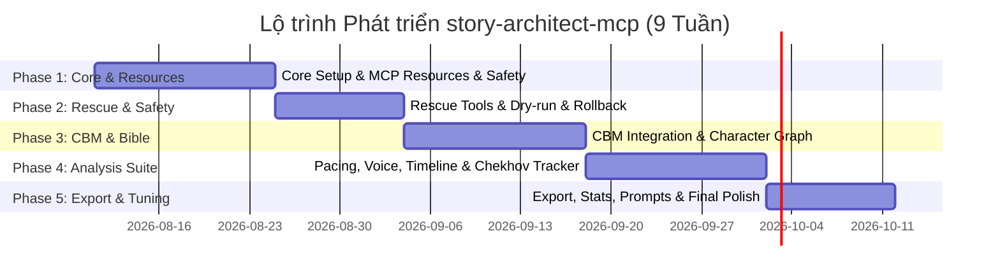

# Plan Chi Tiết Dự Án `story-architect-mcp` (Phiên bản Nâng cấp)

## 1. Triết lý Thiết kế & Cơ chế Kết hợp với `codebase-memory-mcp`

`codebase-memory-mcp` sử dụng Knowledge Graph (thực thể & quan hệ) và vector indexing để hiểu code. Chúng ta sẽ **biến cấu trúc tiểu thuyết thành một hệ thống codebase**:

* **Codebase (Code) $\leftrightarrow$ Novel Base (Văn bản):**
  * Các thư mục/tệp chứa Chương/Cảnh = File/Module.
  * Nhân vật, Địa danh, Lore, Ma pháp/Công nghệ, Cốt truyện (Subplot) = Class/Interface/Data Model.
  * Mối quan hệ giữa các nhân vật/sự kiện = Dependency / Function Calls.
  * Tình tiết mâu thuẫn (Plot hole), lỗi Lịch sử (Inconsistency) = Bug / Lint Error.

* **Sự phân công trách nhiệm (Separation of Concerns):**
  * **`codebase-memory-mcp`**: Chịu trách nhiệm Indexing (Chỉ mục hoá toàn văn), Tìm kiếm ngữ nghĩa (Semantic Search), Tóm tắt tri thức tĩnh, Trích xuất đồ thị tri thức (Knowledge Graph) từ các tệp `.md` / `.txt`.
  * **`story-architect-mcp` (Server mới)**: Chịu trách nhiệm Cung cấp quy trình biên tập (Workflow), Phân tích cấu trúc truyện dài, Tự động dọn dẹp các dự án loạn cào cào, Kiểm soát nhịp phim/truyện (Pacing), Cài cắm/Giải gỡ tình tiết (Chekhov's Gun Tracker), Giữ vững văn phong (Voice Consistency), và Tạo prompts gợi ý viết tiếp.

* **Tuân thủ MCP Spec mới nhất (Stateless Architecture):**
  * Thiết kế theo mô hình **Stateless Request/Response**, state được lưu trữ minh bạch trong `.story/`.
  * Thay vì dùng Sampling (đã bị deprecated), server gọi trực tiếp LLM Provider API hoặc truyền context tối ưu về Client để Agent xử lý.

---

## 2. Chuẩn hóa Cấu trúc Thư mục Dự án Tiểu thuyết

`story-architect-mcp` quy định layout chuẩn (tự động chuyển đổi thông qua tool):

```text
my-epic-novel/
├── .cbm/                        # Knowledge Graph index cache (tự build nội bộ)
│   └── index.json               # Entity/relationship index cho story_query_context
├── .story/                      # Metadata & State của story-architect-mcp
│   ├── config.json              # Cấu hình dự án (Tên, Tác giả, Thể loại, POV, Tense...)
│   ├── status.json              # Trạng thái dự án, tiến độ, word count
│   ├── timeline.json            # Mốc thời gian tuyệt đối & tương đối
│   ├── unresolved_holes.json    # Danh sách các hố/mâu thuẫn chưa lấp
│   ├── relationships.json       # Graph quan hệ nhân vật theo thời gian
│   ├── foreshadowing.json       # Chekhov's gun tracker (Setups & Payoffs)
│   ├── style_guide.json           # Quy chuẩn giọng văn (Voice & Style reference)
│   └── snapshots/               # Lịch sử phiên bản (Revision history / Rollback)
├── bible/                       # Kinh thánh tiểu thuyết (Lore & Bible)
│   ├── characters/              # Hồ sơ nhân vật (Main, Side, Background)
│   ├── world/                   # Worldbuilding (Địa lý, Ma pháp, Lịch sử)
│   └── subplots/                # Các tuyến truyện phụ (Romantic, Revenge...)
├── manuscript/                  # Bản thảo chính thức
│   ├── arc_01/
│   │   ├── ch_001.md
│   │   └── ch_002.md
├── drafts_raw/                  # Nơi chứa các chương viết dở, xáo trộn
└── outline/                     # Dàn ý dự án
    ├── synopsis.md              # Tóm tắt tổng thể
    ├── themes.md                # Chủ đề & Motif xuyên suốt
    └── arc_01/
        ├── overview.md          # Tóm tắt Arc
        ├── ch_001_outline.md    # Dàn ý chi tiết từng chương
        └── ch_002_outline.md
```

---

## 3. Kiến trúc Primitives: Resources, Prompts & Tools

### 3.1 MCP Resources (Read-Only Data & Subscriptions)

Server expose dữ liệu dưới dạng read-only Resources giúp Agent và Client tự động cập nhật context mà không cần gọi tool thủ công:

| Resource URI | Mô tả | Ứng dụng |
|---|---|---|
| `story://status` | Trạng thái dự án & word count từ `.story/status.json` | Dashboard tiến độ |
| `story://config` | Cấu hình dự án từ `.story/config.json` | Đọc thiết lập POV, Tense, Thể loại |
| `story://timeline` | Timeline tổng thể câu chuyện | Cung cấp ngữ cảnh thời gian |
| `story://holes` | Danh sách plot holes chưa giải quyết | Nhắc nhở các điểm mâu thuẫn |
| `story://foreshadowing` | Danh sách các chi tiết cài cắm (Setups chưa Payoff) | Theo dõi chi tiết cần gỡ nút |
| `story://relationships` | Ma trận quan hệ nhân vật hiện tại | Theo dõi biến động quan hệ |
| `story://bible/characters/{name}` | Hồ sơ chi tiết của từng nhân vật | Auto-attach khi đề cập nhân vật |
| `story://bible/world/{location}` | Thông tin bối cảnh/địa danh | Auto-attach khi đến địa điểm mới |
| `story://manuscript/{arc}/{chapter}` | Nội dung bản thảo từng chương | Client cache & subscribe thay đổi |

### 3.2 MCP Prompts (Workflow Templates / Slash Commands)

Cung cấp các quy trình làm việc chuẩn hóa mà người dùng có thể nhanh chóng kích hoạt qua UI hoặc Slash Command:

| Prompt Name | Slash Command | Mô tả Quy trình |
|---|---|---|
| `write-next-chapter` | `/write-next-chapter` | Tự động gom Lore + Chương liền trước + Dàn ý chương mới + Style Guide → Prompt tối ưu để viết |
| `character-deep-dive` | `/character {name}` | Tổng hợp hồ sơ từ Bible + toàn bộ các cảnh xuất hiện trong Manuscript |
| `continuity-audit` | `/audit {arc}` | Quét toàn bộ Arc để phát hiện mâu thuẫn timeline, lặp từ & mâu thuẫn thiết lập |
| `rescue-project` | `/rescue {path}` | Workflow từng bước giúp quét, phân loại, preview và tái cấu trúc thư mục lộn xộn |
| `brainstorm-scene` | `/brainstorm` | Dựa trên bối cảnh hiện tại & outline, gợi ý 3-5 hướng triển khai cảnh tiếp theo |

---

### 3.3 Nhóm Tools của `story-architect-mcp` (16 Tools)

Tất cả các tool thực thi có tác động làm thay đổi dữ liệu (side-effects) đều hỗ trợ cơ chế **Dry-run Mode** và **Confirmation Protocol** (tham số `confirm: boolean`).

#### Nhóm 1: Nhóm Dọn dẹp & Giải cứu Dự án (Rescue & Restructure)
1. **`story_scan_messy_project`**
   * *Input:* `path`, `options?`.
   * *Task:* Quét toàn bộ tệp, phát hiện trùng lặp, nhận diện encoding (UTF-8, Windows-1252...), đo độ tương đồng (similarity matrix), phân loại vào 4 nhóm: **Manuscript**, **Notes**, **Lore**, **Outline** kèm theo `confidence_score`.
2. **`story_auto_refactor_structure`**
   * *Input:* `strategy` (`by_chapter`, `by_arc`, `chronological`), `confirm: boolean`.
   * *Task:* Phân loại và chuẩn hóa thư mục theo layout. Khi `confirm: false`, chỉ trả về danh sách Preview các thao tác di chuyển/đổi tên.
3. **`story_snapshot` / `story_rollback`**
   * *Task:* Lưu snapshot trạng thái dự án trước các đợt refactor lớn hoặc khôi phục dự án về snapshot trước đó từ `.story/snapshots/`.

#### Nhóm 2: Nhóm Tích hợp Đồ thị Trí nhớ & Quan hệ (Memory & Graph)
4. **`story_extract_entities_to_bible`**
   * *Input:* `chapter_path`, `confirm: boolean`.
   * *Task:* Phân tích văn bản chương, tự động đề xuất/tạo các file Markdown nhân vật/địa danh trong `bible/` với định dạng YAML frontmatter chuẩn hóa cho hệ thống Knowledge Graph nội bộ.
5. **`story_query_context`**
   * *Input:* `query`, `budget_tokens?`, `max_depth?`, `rebuild_index?`.
   * *Task:* Kết hợp thông tin Đồ thị quan hệ từ Knowledge Graph nội bộ (cache `.cbm/index.json`) + BFS mở rộng thực thể để trích xuất Context Budget tối ưu nhất cho lượt viết tiếp theo.
6. **`story_map_relationships`**
   * *Input:* `chapter_range?`.
   * *Task:* Phân tích và xây dựng Đồ thị quan hệ giữa các nhân vật (bạn bè, kẻ thù, đồng minh...) theo tiến trình câu chuyện, lưu vào `.story/relationships.json`.

#### Nhóm 3: Nhóm Phân tích Nhịp Truyện, Timeline, Voice & Foreshadowing
7. **`story_detect_timeline_conflicts`**
   * *Task:* Phân tích các mốc thời gian tuyệt đối & tương đối, tuổi tác, sự kiện để phát hiện mâu thuẫn. Xuất Mermaid Gantt Chart trực quan hóa Timeline.
8. **`story_analyze_pacing`**
   * *Input:* `chapter_range`.
   * *Task:* Đo lường tỷ lệ Action / Dialogue / Description, đường cong căng thẳng (Tension curve) và cấu trúc nhịp cảnh (Scene beat analysis).
9. **`story_analyze_voice`**
   * *Input:* `chapter_range`, `sample_chapters?`.
   * *Task:* Phân tích giọng văn (độ dài câu, vốn từ, POV, Tense, nhịp điệu thoại) và kiểm tra hiện tượng trôi văn phong (Voice drift) so với `style_guide.json`.
10. **`story_log_setup` / `story_log_payoff` / `story_list_unfired`** (Chekhov's Gun Tracker)
    * *Task:* Đánh dấu chi tiết cài cắm (`story_log_setup`), chi tiết giải gỡ (`story_log_payoff`), và liệt kê các "khẩu súng Chekhov chưa bắn" (Unfired Chekhov's guns) lưu trong `.story/foreshadowing.json`.

#### Nhóm 4: Nhóm Hỗ trợ Sáng tác, Quản lý & Xuất bản (Continuation, Management & Export)
11. **`story_generate_writing_prompt`**
    * *Input:* `target_chapter_id`, `strategy` (`continue` | `rewrite` | `expand`).
    * *Task:* Đọc chương trước + Dàn ý + Lore + Style Guide + Context Budget → Tạo System Prompt gọt giũa hoàn hảo.
12. **`story_log_plot_hole` / `story_resolve_plot_hole`**
    * *Task:* Quản lý danh sách các điểm mâu thuẫn hoặc lỗ hổng cốt truyện trong `unresolved_holes.json`.
13. **`story_stats`**
    * *Task:* Thống kê tổng số từ (word count), tốc độ viết (writing velocity), phần trăm hoàn thành mục tiêu.
14. **`story_export`**
    * *Input:* `format` (`markdown_single` | `html` | `epub` | `docx`), `options?`. (`pdf` trả về gợi ý xuất qua `html` + print-to-PDF.)
    * *Task:* Đóng gói và xuất bản toàn bộ tác phẩm thành file hoàn chỉnh kèm mục lục và thông tin tác giả.

> Ghi chú: Đây là danh sách các tool cốt lõi; server thực tế đăng ký **21 tool** (bao gồm `story_init`, `story_set_project`, `story_get_project_info`, `story_scan_messy_project`, `story_snapshot`, `story_rollback`...).

---

## 4. An toàn Dữ liệu & Quy chuẩn Thực thi (Data Safety)

1. **Dry-run First**: Mọi tool thay đổi cấu trúc file hoặc chỉnh sửa nội dung văn bản đều mặc định chạy ở chế độ Preview (`confirm: false`). Agent bắt buộc phải xác nhận kết quả Preview với User trước khi truyền `confirm: true`.
2. **Tự động Snapshot**: Trước khi thực hiện `story_auto_refactor_structure`, hệ thống tự động gọi `story_snapshot` để tạo điểm phục hồi an toàn.

---

## 5. Lộ trình Phát triển (Roadmap 9 Tuần / 5 Phase)



### Chi tiết các Phase:
* **Phase 1 (Tuần 1-2): Core Infra & MCP Resources**: Thiết lập MCP Server TypeScript (Stateless), cài đặt Resources (`story://status`, `story://config`...), Prompts cơ bản, và hệ thống Snapshot.
* **Phase 2 (Tuần 3-4): Rescue Tools & Dry-run**: Phát triển `story_scan_messy_project`, `story_auto_refactor_structure` tích hợp Dry-run và Rollback protocol.
* **Phase 3 (Tuần 4-6): Memory Integration & Relationship Graph**: Xây dựng Knowledge Graph nội bộ (`.cbm/index.json`), hoàn thiện `story_extract_entities_to_bible`, `story_query_context` và `story_map_relationships`.
* **Phase 4 (Tuần 6-8): Suite Phân Tích Chuyên Sâu**: Xây dựng `story_detect_timeline_conflicts` (Mermaid Gantt), `story_analyze_pacing`, `story_analyze_voice`, và `story_log_setup`/`story_log_payoff`/`story_list_unfired`.
* **Phase 5 (Tuần 8-9): Export, Stats & Tuning**: Hoàn thiện `story_export`, `story_stats`, gọt giũa prompt generator và thử nghiệm trên tiểu thuyết thực tế.

---

## 6. Ví dụ Quy trình AI Agent Sử dụng Tool (Workflow Mẫu)

1. **User kích hoạt Prompt:** `/rescue /path/to/old-novel`
2. **AI Agent gọi `story_scan_messy_project`**: Phát hiện 25 tệp tin lộn xộn, nhận diện encoding và đưa ra preview phân loại.
3. **AI Agent gọi `story_auto_refactor_structure(confirm=false)`**: Hiển thị bảng Preview danh sách file sẽ được cấu trúc lại vào `manuscript/` và `bible/`.
4. **User đồng ý** $\rightarrow$ Agent gọi `story_auto_refactor_structure(confirm=true)`. Hệ thống tự động snapshot trước khi di chuyển file.
5. **Client subscribe Resource `story://status`**: Trạng thái cấu trúc mới lập tức cập nhật lên Dashboard.
6. **`story_query_context` tự build Knowledge Graph nội bộ**: Xây dựng index `.cbm/index.json` cho tìm kiếm ngữ nghĩa và BFS mở rộng quan hệ.
7. **User kích hoạt Prompt:** `/write-next-chapter` $\rightarrow$ Agent tự động tổng hợp Lore từ Resources, check Chekhov's Gun chưa payoff, lấy Style guide và tạo câu chữ nối tiếp mạch câu chuyện một cách mượt mà nhất.
